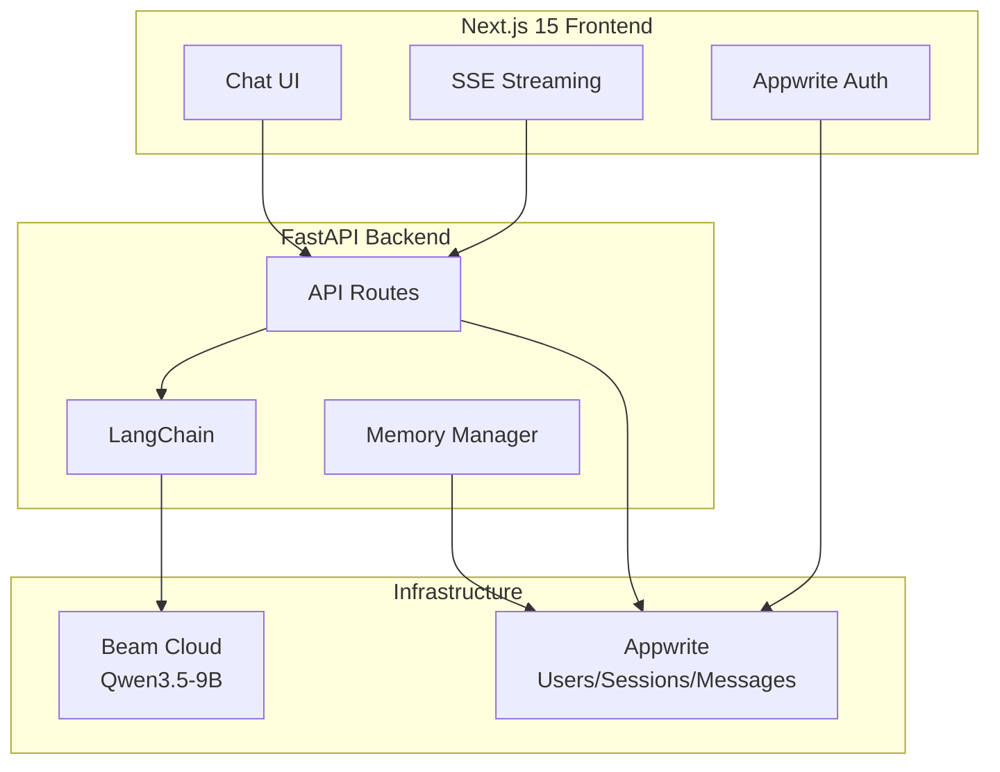
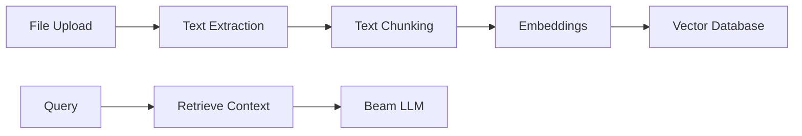

### run 
Configure environment: Update .env files with your Beam and Appwrite credentials

Install dependencies:

cd backend && pip install -r requirements.txt
cd frontend && npm install
Deploy Beam model:

cd beam_deploy && beam deploy app.py
Start servers:

# Backend
cd backend && uvicorn main:app --reload --port 8000

# Frontend
cd frontend && npm run dev

---

# TheChatBot Project - Detailed Technical Plan

## Project Overview

TheChatBot is a private ChatGPT-like application featuring:
- **LLM Engine**: Qwen3.5-9B-Uncensored deployed on Beam Cloud
- **Backend**: FastAPI with LangChain integration
- **Frontend**: Next.js 15 (App Router)
- **Database & Auth**: Appwrite (self-hosted or cloud)

---

## 4-Phase Roadmap

| Phase | Features | Description |
|-------|----------|-------------|
| **Phase 1** | Streaming + Sessions + Memory + Auth | Core chat functionality with real-time streaming |
| **Phase 2** | File Upload + RAG | Document processing and retrieval-augmented generation |
| **Phase 3** | Web Search Agent | Internet search integration for up-to-date information |
| **Phase 4** | Voice I/O + Personas | Voice conversation and custom chatbot personalities |

---

## System Architecture



---

## Phase 1 - Detailed Implementation Plan

### 1.1 Directory Structure

```
TheChatBot/
├── backend/                        # FastAPI
│   ├── main.py                     # App entry point
│   ├── requirements.txt            # Python dependencies
│   ├── .env                        # Environment variables
│   │
│   ├── core/
│   │   ├── __init__.py
│   │   ├── config.py               # All env vars management
│   │   ├── beam_llm.py             # Custom LangChain LLM wrapper
│   │   └── memory.py               # LangChain memory setup
│   │
│   ├── routes/
│   │   ├── __init__.py
│   │   ├── chat.py                 # /chat/stream SSE endpoint
│   │   ├── sessions.py             # CRUD for sessions
│   │   └── memory.py               # Save/fetch memory
│   │
│   ├── services/
│   │   ├── __init__.py
│   │   ├── appwrite_service.py     # All Appwrite DB operations
│   │   └── stream_service.py       # SSE token streaming logic
│   │
│   └── models/
│       ├── __init__.py
│       ├── chat.py                 # Pydantic request/response models
│       └── session.py
│
├── beam_deploy/                    # Beam Cloud Deployment
│   └── app.py                      # Qwen3.5-9B deployment script
│
├── frontend/                       # Next.js 15
│   ├── package.json
│   ├── .env.local
│   ├── tsconfig.json
│   ├── next.config.js
│   │
│   ├── app/
│   │   ├── layout.tsx              # Root layout with providers
│   │   ├── page.tsx                # Redirect to /chat
│   │   ├── globals.css
│   │   ├── auth/
│   │   │   └── page.tsx            # Login/Signup page
│   │   └── chat/
│   │       ├── page.tsx            # Main chat page
│   │       └── [sessionId]/
│   │           └── page.tsx        # Individual session chat
│   │
│   ├── components/
│   │   ├── sidebar/
│   │   │   ├── Sidebar.tsx         # Session list sidebar
│   │   │   └── SessionItem.tsx     # Individual session row
│   │   ├── chat/
│   │   │   ├── ChatWindow.tsx      # Message display container
│   │   │   ├── MessageBubble.tsx   # Individual message
│   │   │   ├── InputBar.tsx        # Prompt input + send
│   │   │   └── StreamingText.tsx   # Live token rendering
│   │   └── ui/                     # shadcn/ui components
│   │       ├── button.tsx
│   │       ├── input.tsx
│   │       ├── textarea.tsx
│   │       ├── card.tsx
│   │       └── ...
│   │
│   ├── hooks/
│   │   ├── useChat.ts              # SSE streaming logic
│   │   └── useSessions.ts          # Session management
│   │
│   ├── lib/
│   │   ├── appwrite.ts             # Appwrite client config
│   │   └── api.ts                  # FastAPI calls wrapper
│   │
│   └── types/
│       └── index.ts                # Shared TypeScript types
│
└── plans/
    └── plan.md                     # This file
```

---

### 1.2 Beam Cloud Deployment (`beam_deploy/app.py`)

**Correct SDK v2 Syntax:**

```python
from beam import endpoint, Image, Volume
import os

VOLUME_PATH = "./model_weights"

def load_model():
    """Load model once per container lifecycle"""
    from transformers import AutoTokenizer, AutoModelForCausalLM
    import torch
    
    model_id = "HauhauCS/Qwen3.5-9B-Uncensored-HauhauCS-Aggressive"
    tokenizer = AutoTokenizer.from_pretrained(
        model_id, 
        cache_dir=VOLUME_PATH
    )
    model = AutoModelForCausalLM.from_pretrained(
        model_id, 
        torch_dtype=torch.float16,
        device_map="auto", 
        load_in_4bit=True,
        cache_dir=VOLUME_PATH
    )
    return {"model": model, "tokenizer": tokenizer}

@endpoint(
    name="private-qwen-9b",
    image=Image(python_version="python3.11")
        .add_python_packages([
            "transformers", 
            "torch", 
            "bitsandbytes", 
            "accelerate"
        ]),
    gpu="RTX4090",
    cpu=2,
    memory="16Gi",
    keep_warm_seconds=0,
    on_start=load_model,
    volumes=[Volume(name="model-weights", mount_path=VOLUME_PATH)],
)
def generate(context, **inputs):
    """Main inference endpoint"""
    model = context.on_start_value["model"]
    tokenizer = context.on_start_value["tokenizer"]
    
    messages = inputs.get("history", [])
    messages.append({"role": "user", "content": inputs["prompt"]})
    
    text = tokenizer.apply_chat_template(
        messages, 
        tokenize=False, 
        add_generation_prompt=True
    )
    enc = tokenizer([text], return_tensors="pt").to("cuda")
    
    with torch.no_grad():
        out = model.generate(
            **enc, 
            max_new_tokens=512,
            temperature=0.7,
            do_sample=True
        )
    
    response = tokenizer.decode(out[0], skip_special_tokens=True)
    return {"response": response}
```

**Alternative: vLLM Integration (3-5x faster):**

```python
from beam import integrations

vllm_args = integrations.VLLMArgs()
vllm_args.model = "HauhauCS/Qwen3.5-9B-Uncensored-HauhauCS-Aggressive"
vllm_args.gpu_memory_utilization = 0.9
vllm_args.tensor_parallel_size = 1

vllm_app = integrations.VLLM(
    name="qwen-vllm",
    gpu="RTX4090",
    memory="16Gi",
    cpu=2,
    keep_warm_seconds=0,
    secrets=["HF_TOKEN"],
    vllm_args=vllm_args
)
```

---

### 1.3 Backend Configuration

#### `backend/core/config.py`

```python
from pydantic_settings import BaseSettings
from typing import Optional

class Settings(BaseSettings):
    # Beam Cloud
    beam_endpoint_url: str
    beam_token: str
    
    # Appwrite
    appwrite_endpoint: str
    appwrite_project_id: str
    appwrite_api_key: str
    appwrite_db_id: str
    
    # App
    api_host: str = "0.0.0.0"
    api_port: int = 8000
    
    class Config:
        env_file = ".env"

settings = Settings()
```

---

### 1.4 Custom LangChain LLM Wrapper

#### `backend/core/beam_llm.py`

```python
from langchain.llms.base import LLM
from langchain.callbacks.manager import CallbackManagerForLLMRun
from typing import Optional, List, Any
import requests
import os

class BeamLLM(LLM):
    """Custom LangChain LLM that calls Beam Cloud endpoint"""
    
    endpoint_url: str = os.getenv("BEAM_ENDPOINT_URL", "")
    beam_token: str = os.getenv("BEAM_TOKEN", "")
    
    @property
    def _llm_type(self) -> str:
        return "beam"
    
    def _call(
        self,
        prompt: str,
        stop: Optional[List[str]] = None,
        run_manager: Optional[CallbackManagerForLLMRun] = None,
        **kwargs: Any
    ) -> str:
        """Call Beam endpoint and return response"""
        history = kwargs.get("history", [])
        
        response = requests.post(
            self.endpoint_url,
            headers={
                "Authorization": f"Bearer {self.beam_token}",
                "Content-Type": "application/json"
            },
            json={
                "prompt": prompt,
                "history": history
            },
            timeout=300
        )
        
        if response.status_code != 200:
            raise Exception(f"Beam API error: {response.text}")
        
        return response.json()["response"]
    
    async def _acall(
        self,
        prompt: str,
        stop: Optional[List[str]] = None,
        run_manager: Optional[CallbackManagerForLLMRun] = None,
        **kwargs: Any
    ) -> str:
        """Async version for streaming"""
        import aiohttp
        
        history = kwargs.get("history", [])
        
        async with aiohttp.ClientSession() as session:
            async with session.post(
                self.endpoint_url,
                headers={
                    "Authorization": f"Bearer {self.beam_token}",
                    "Content-Type": "application/json"
                },
                json={
                    "prompt": prompt,
                    "history": history
                },
                timeout=aiohttp.ClientTimeout(total=300)
            ) as response:
                if response.status != 200:
                    text = await response.text()
                    raise Exception(f"Beam API error: {text}")
                
                data = await response.json()
                return data["response"]
```

---

### 1.5 Memory Management

#### `backend/core/memory.py`

```python
from langchain.memory import ConversationBufferWindowMemory
from langchain.memory.chat_message_histories import DynamoDBChatMessageHistory
from typing import Optional

def create_memory(window_size: int = 10) -> ConversationBufferWindowMemory:
    """Create conversation memory with window size"""
    return ConversationBufferWindowMemory(
        k=window_size,
        return_messages=True,
        output_key="output",
        input_key="input"
    )

def create_appwrite_memory(
    session_id: str,
    appwrite_service
) -> ConversationBufferWindowMemory:
    """Create memory backed by Appwrite"""
    # Custom implementation to load from Appwrite
    messages = appwrite_service.get_messages(session_id)
    
    memory = ConversationBufferWindowMemory(
        k=10,
        return_messages=True
    )
    
    for msg in messages:
        if msg["role"] == "user":
            memory.chat_memory.add_user_message(msg["content"])
        else:
            memory.chat_memory.add_ai_message(msg["content"])
    
    return memory
```

---

### 1.6 Appwrite Service

#### `backend/services/appwrite_service.py`

```python
from appwrite.client import Client
from appwrite.services.databases import Databases
from appwrite.services.users import Users
from appwrite.services.auth import Auth
from typing import List, Dict, Optional
import os

class AppwriteService:
    def __init__(self):
        self.client = Client()
        self.client.set_endpoint(os.getenv("APPWRITE_ENDPOINT"))
        self.client.set_project(os.getenv("APPWRITE_PROJECT_ID"))
        self.client.set_key(os.getenv("APPWRITE_API_KEY"))
        
        self.database_id = os.getenv("APPWRITE_DB_ID")
        self.databases = Databases(self.client)
        self.users = Users(self.client)
        self.auth = Auth(self.client)
    
    # === User Methods ===
    def create_user(self, email: str, password: str) -> Dict:
        return self.users.create(email, password)
    
    def get_user(self, user_id: str) -> Dict:
        return self.users.get(user_id)
    
    def create_session(self, email: str, password: str) -> Dict:
        return self.auth.createEmailSession(email, password)
    
    def delete_session(self, session_id: str):
        return self.auth.deleteSession(session_id)
    
    # === Session Methods ===
    def create_session_record(
        self, 
        user_id: str, 
        title: str = "New Chat"
    ) -> Dict:
        import uuid
        session_id = str(uuid.uuid4())
        
        return self.databases.create_document(
            self.database_id,
            "sessions",
            session_id,
            {
                "session_id": session_id,
                "user_id": user_id,
                "title": title,
                "created_at": "now()"
            }
        )
    
    def get_sessions(self, user_id: str) -> List[Dict]:
        # Query sessions collection by user_id
        return self.databases.list_documents(
            self.database_id,
            "sessions",
            queries=[f'equal("user_id", "{user_id}")']
        )
    
    def delete_session_record(self, session_id: str):
        self.databases.delete_document(
            self.database_id,
            "sessions",
            session_id
        )
    
    # === Message Methods ===
    def save_message(
        self,
        session_id: str,
        role: str,
        content: str
    ) -> Dict:
        import uuid
        message_id = str(uuid.uuid4())
        
        return self.databases.create_document(
            self.database_id,
            "messages",
            message_id,
            {
                "message_id": message_id,
                "session_id": session_id,
                "role": role,
                "content": content,
                "created_at": "now()"
            }
        )
    
    def get_messages(self, session_id: str) -> List[Dict]:
        return self.databases.list_documents(
            self.database_id,
            "messages",
            queries=[f'equal("session_id", "{session_id}")']
        )
    
    # === Memory Methods ===
    def save_memory(self, user_id: str, summary: str):
        # Upsert memory document
        docs = self.databases.list_documents(
            self.database_id,
            "memory",
            queries=[f'equal("user_id", "{user_id}")']
        )
        
        if docs["total"] > 0:
            doc_id = docs["documents"][0]["$id"]
            self.databases.update_document(
                self.database_id,
                "memory",
                doc_id,
                {"summary": summary, "updated_at": "now()"}
            )
        else:
            import uuid
            self.databases.create_document(
                self.database_id,
                "memory",
                str(uuid.uuid4()),
                {"user_id": user_id, "summary": summary}
            )
    
    def get_memory(self, user_id: str) -> Optional[str]:
        docs = self.databases.list_documents(
            self.database_id,
            "memory",
            queries=[f'equal("user_id", "{user_id}")']
        )
        
        if docs["total"] > 0:
            return docs["documents"][0]["summary"]
        return None
```

---

### 1.7 Chat Routes with Streaming

#### `backend/routes/chat.py`

```python
from fastapi import APIRouter, Depends, Request
from fastapi.responses import StreamingResponse
from pydantic import BaseModel
from typing import List, Optional
import json
import asyncio
from core.beam_llm import BeamLLM
from core.memory import create_appwrite_memory
from services.appwrite_service import AppwriteService
import os

router = APIRouter(prefix="/chat", tags=["chat"])

class ChatRequest(BaseModel):
    session_id: str
    prompt: str
    history: List[dict] = []

class ChatResponse(BaseModel):
    response: str
    session_id: str

@router.post("/stream")
async def chat_stream(request: ChatRequest, req: Request):
    """Streaming chat endpoint using SSE"""
    
    # Initialize services
    beam_llm = BeamLLM(
        endpoint_url=os.getenv("BEAM_ENDPOINT_URL"),
        beam_token=os.getenv("BEAM_TOKEN")
    )
    appwrite = AppwriteService()
    
    # Save user message
    appwrite.save_message(
        session_id=request.session_id,
        role="user",
        content=request.prompt
    )
    
    async def token_generator():
        try:
            # Build conversation context
            messages = request.history.copy()
            messages.append({"role": "user", "content": request.prompt})
            
            # Get streaming response from Beam
            # For true streaming, we need to implement chunked response
            response = await beam_llm._acall(
                prompt=request.prompt,
                history=request.history
            )
            
            # Stream tokens one by one
            buffer = ""
            for word in response.split():
                buffer += word + " "
                yield f"data: {json.dumps({'token': word + ' '})}\n\n"
                await asyncio.sleep(0.03)  # Simulate streaming delay
            
            # Save assistant message
            appwrite.save_message(
                session_id=request.session_id,
                role="assistant",
                content=response
            )
            
            yield "data: [DONE]\n\n"
            
        except Exception as e:
            yield f"data: {json.dumps({'error': str(e)})}\n\n"
    
    return StreamingResponse(
        token_generator(),
        media_type="text/event-stream",
        headers={
            "Cache-Control": "no-cache",
            "Connection": "keep-alive",
            "X-Accel-Buffering": "no"
        }
    )

@router.post("/non-stream")
async def chat_non_stream(request: ChatRequest):
    """Non-streaming chat endpoint"""
    
    beam_llm = BeamLLM(
        endpoint_url=os.getenv("BEAM_ENDPOINT_URL"),
        beam_token=os.getenv("BEAM_TOKEN")
    )
    appwrite = AppwriteService()
    
    # Get response
    response = await beam_llm._acall(
        prompt=request.prompt,
        history=request.history
    )
    
    # Save messages
    appwrite.save_message(request.session_id, "user", request.prompt)
    appwrite.save_message(request.session_id, "assistant", response)
    
    return ChatResponse(response=response, session_id=request.session_id)
```

---

### 1.8 Session Routes

#### `backend/routes/sessions.py`

```python
from fastapi import APIRouter, Depends
from pydantic import BaseModel
from typing import List, Optional
from services.appwrite_service import AppwriteService

router = APIRouter(prefix="/sessions", tags=["sessions"])

class CreateSessionRequest(BaseModel):
    user_id: str
    title: Optional[str] = "New Chat"

class SessionResponse(BaseModel):
    session_id: str
    user_id: str
    title: str
    created_at: str

@router.post("/", response_model=SessionResponse)
async def create_session(request: CreateSessionRequest):
    """Create a new chat session"""
    appwrite = AppwriteService()
    
    result = appwrite.create_session_record(
        user_id=request.user_id,
        title=request.title or "New Chat"
    )
    
    return SessionResponse(
        session_id=result["session_id"],
        user_id=result["user_id"],
        title=result["title"],
        created_at=result["created_at"]
    )

@router.get("/", response_model=List[SessionResponse])
async def get_sessions(user_id: str):
    """Get all sessions for a user"""
    appwrite = AppwriteService()
    
    sessions = appwrite.get_sessions(user_id)
    
    return [
        SessionResponse(
            session_id=s["session_id"],
            user_id=s["user_id"],
            title=s["title"],
            created_at=s["created_at"]
        )
        for s in sessions["documents"]
    ]

@router.delete("/{session_id}")
async def delete_session(session_id: str):
    """Delete a session and its messages"""
    appwrite = AppwriteService()
    appwrite.delete_session_record(session_id)
    
    return {"status": "deleted", "session_id": session_id}
```

---

### 1.9 Backend Entry Point

#### `backend/main.py`

```python
from fastapi import FastAPI
from fastapi.middleware.cors import CORSMiddleware
from routes import chat, sessions, memory
from core.config import settings
import os

app = FastAPI(
    title="TheChatBot API",
    description="Private ChatGPT-like API with Beam Cloud LLM",
    version="1.0.0"
)

# CORS
app.add_middleware(
    CORSMiddleware,
    allow_origins=["http://localhost:3000"],
    allow_credentials=True,
    allow_methods=["*"],
    allow_headers=["*"],
)

# Routes
app.include_router(chat.router)
app.include_router(sessions.router)
app.include_router(memory.router)

@app.get("/")
async def root():
    return {"message": "TheChatBot API", "status": "running"}

@app.get("/health")
async def health():
    return {"status": "healthy"}

if __name__ == "__main__":
    import uvicorn
    uvicorn.run(
        "main:app",
        host=settings.api_host,
        port=settings.api_port,
        reload=True
    )
```

---

### 1.10 Frontend - Chat Hook

#### `frontend/hooks/useChat.ts`

```typescript
import { useState, useCallback, useRef } from 'react';

export interface Message {
  role: 'user' | 'assistant';
  content: string;
}

export function useChat(sessionId: string) {
  const [messages, setMessages] = useState<Message[]>([]);
  const [streaming, setStreaming] = useState(false);
  const [error, setError] = useState<string | null>(null);
  const abortControllerRef = useRef<AbortController | null>(null);

  const sendMessage = useCallback(async (prompt: string) => {
    // Cancel any ongoing request
    if (abortControllerRef.current) {
      abortControllerRef.current.abort();
    }
    abortControllerRef.current = new AbortController();

    setStreaming(true);
    setError(null);

    // Add user message
    const userMessage: Message = { role: 'user', content: prompt };
    setMessages(prev => [...prev, userMessage]);

    // Add placeholder for assistant response
    const assistantMessage: Message = { role: 'assistant', content: '' };
    setMessages(prev => [...prev, assistantMessage]);

    let buffer = '';

    try {
      const response = await fetch(`${process.env.NEXT_PUBLIC_API_URL}/chat/stream`, {
        method: 'POST',
        headers: {
          'Content-Type': 'application/json',
        },
        body: JSON.stringify({
          session_id: sessionId,
          prompt,
          history: messages,
        }),
        signal: abortControllerRef.current.signal,
      });

      if (!response.ok) {
        throw new Error(`HTTP error! status: ${response.status}`);
      }

      if (!response.body) {
        throw new Error('No response body');
      }

      const reader = response.body.getReader();
      const decoder = new TextDecoder();

      while (true) {
        const { done, value } = await reader.read();
        if (done) break;

        const chunk = decoder.decode(value);
        const lines = chunk.split('\n\n');

        for (const line of lines) {
          if (line.startsWith('data: ') && line !== 'data: [DONE]') {
            try {
              const data = JSON.parse(line.replace('data: ', ''));
              if (data.token) {
                buffer += data.token;
                setMessages(prev => [
                  ...prev.slice(0, -1),
                  { role: 'assistant', content: buffer },
                ]);
              }
            } catch (e) {
              // Skip invalid JSON
            }
          }
        }
      }
    } catch (e: any) {
      if (e.name !== 'AbortError') {
        setError(e.message);
      }
    } finally {
      setStreaming(false);
    }
  }, [sessionId, messages]);

  const clearMessages = useCallback(() => {
    setMessages([]);
  }, []);

  return {
    messages,
    sendMessage,
    streaming,
    error,
    clearMessages,
  };
}
```

---

### 1.11 Frontend - Chat Window Component

#### `frontend/components/chat/ChatWindow.tsx`

```typescript
'use client';

import { useState, useRef, useEffect } from 'react';
import { useChat } from '@/hooks/useChat';
import { MessageBubble } from './MessageBubble';
import { InputBar } from './InputBar';
import { StreamingText } from './StreamingText';

interface ChatWindowProps {
  sessionId: string;
}

export function ChatWindow({ sessionId }: ChatWindowProps) {
  const { messages, sendMessage, streaming, error } = useChat(sessionId);
  const messagesEndRef = useRef<HTMLDivElement>(null);

  const scrollToBottom = () => {
    messagesEndRef.current?.scrollIntoView({ behavior: 'smooth' });
  };

  useEffect(() => {
    scrollToBottom();
  }, [messages]);

  const handleSend = async (prompt: string) => {
    await sendMessage(prompt);
  };

  return (
    <div className="flex flex-col h-full">
      {/* Messages */}
      <div className="flex-1 overflow-y-auto p-4 space-y-4">
        {messages.length === 0 && (
          <div className="text-center text-gray-500 mt-20">
            <h2 className="text-xl font-semibold">Start a conversation</h2>
            <p className="mt-2">Send a message to begin chatting</p>
          </div>
        )}
        
        {messages.map((message, index) => (
          <MessageBubble key={index} message={message} />
        ))}
        
        {streaming && (
          <div className="flex items-center gap-2 text-gray-500">
            <span className="animate-pulse">●</span>
            <StreamingText />
          </div>
        )}
        
        {error && (
          <div className="text-red-500 p-2 bg-red-50 rounded">
            Error: {error}
          </div>
        )}
        
        <div ref={messagesEndRef} />
      </div>

      {/* Input */}
      <InputBar onSend={handleSend} disabled={streaming} />
    </div>
  );
}
```

---

### 1.12 Frontend - Session Sidebar

#### `frontend/components/sidebar/Sidebar.tsx`

```typescript
'use client';

import { useState, useEffect } from 'react';
import { useRouter } from 'next/navigation';
import { SessionItem } from './SessionItem';

interface Session {
  session_id: string;
  title: string;
  created_at: string;
}

export function Sidebar() {
  const [sessions, setSessions] = useState<Session[]>([]);
  const [loading, setLoading] = useState(true);
  const router = useRouter();

  useEffect(() => {
    loadSessions();
  }, []);

  const loadSessions = async () => {
    try {
      const userId = localStorage.getItem('user_id');
      if (!userId) return;

      const response = await fetch(
        `${process.env.NEXT_PUBLIC_API_URL}/sessions?user_id=${userId}`
      );
      const data = await response.json();
      setSessions(data);
    } catch (error) {
      console.error('Failed to load sessions:', error);
    } finally {
      setLoading(false);
    }
  };

  const createNewChat = async () => {
    try {
      const userId = localStorage.getItem('user_id');
      const response = await fetch(
        `${process.env.NEXT_PUBLIC_API_URL}/sessions`,
        {
          method: 'POST',
          headers: { 'Content-Type': 'application/json' },
          body: JSON.stringify({ user_id: userId }),
        }
      );
      const newSession = await response.json();
      router.push(`/chat/${newSession.session_id}`);
    } catch (error) {
      console.error('Failed to create session:', error);
    }
  };

  const deleteSession = async (sessionId: string) => {
    try {
      await fetch(
        `${process.env.NEXT_PUBLIC_API_URL}/sessions/${sessionId}`,
        { method: 'DELETE' }
      );
      setSessions(sessions.filter(s => s.session_id !== sessionId));
    } catch (error) {
      console.error('Failed to delete session:', error);
    }
  };

  return (
    <div className="w-64 bg-gray-900 text-white h-screen flex flex-col">
      <div className="p-4">
        <button
          onClick={createNewChat}
          className="w-full bg-blue-600 hover:bg-blue-700 px-4 py-2 rounded-lg flex items-center justify-center gap-2"
        >
          <span>+</span> New Chat
        </button>
      </div>

      <div className="flex-1 overflow-y-auto p-2">
        {loading ? (
          <div className="text-gray-500 text-center p-4">Loading...</div>
        ) : sessions.length === 0 ? (
          <div className="text-gray-500 text-center p-4">No chats yet</div>
        ) : (
          sessions.map(session => (
            <SessionItem
              key={session.session_id}
              session={session}
              onDelete={() => deleteSession(session.session_id)}
            />
          ))
        )}
      </div>
    </div>
  );
}
```

---

### 1.13 Appwrite Database Schema

Create these collections in Appwrite:

#### `sessions` Collection
| Attribute | Type | Description |
|-----------|------|-------------|
| session_id | string (unique) | UUID for the session |
| user_id | string | Owner user ID |
| title | string | Session title |
| created_at | datetime | Creation timestamp |

#### `messages` Collection
| Attribute | Type | Description |
|-----------|------|-------------|
| message_id | string (unique) | UUID for the message |
| session_id | string | Parent session |
| role | string | "user" or "assistant" |
| content | string | Message content |
| created_at | datetime | Creation timestamp |

#### `memory` Collection
| Attribute | Type | Description |
|-----------|------|-------------|
| user_id | string (unique) | Owner user ID |
| summary | string | LangChain memory summary |
| updated_at | datetime | Last update timestamp |

---

### 1.14 Environment Configuration

#### `backend/.env`

```bash
# Beam Cloud
BEAM_ENDPOINT_URL=https://your-app.beam.cloud
BEAM_TOKEN=your_beam_token

# Appwrite
APPWRITE_ENDPOINT=http://localhost/v1
APPWRITE_PROJECT_ID=your_project_id
APPWRITE_API_KEY=your_api_key
APPWRITE_DB_ID=chatbot_db

# App
API_HOST=0.0.0.0
API_PORT=8000
```

#### `frontend/.env.local`

```bash
NEXT_PUBLIC_APPWRITE_ENDPOINT=http://localhost/v1
NEXT_PUBLIC_APPWRITE_PROJECT_ID=your_project_id
NEXT_PUBLIC_API_URL=http://localhost:8000
```

---

### 1.15 Installation & Deployment

#### Backend Setup

```bash
cd backend

# Create virtual environment
python -m venv venv
source venv/bin/activate  # On Windows: venv\Scripts\activate

# Install dependencies
pip install -r requirements.txt

# Start server
uvicorn main:app --reload --port 8000
```

#### Frontend Setup

```bash
cd frontend

# Install dependencies
npm install

# Start development server
npm run dev
```

#### Beam Deployment

```bash
# Install Beam CLI
pip install beam-client

# Configure with your token
beam configure

# Deploy the model
cd beam_deploy
beam deploy app.py
```

---

## Phase 2: File Upload + RAG (Future)

### Features
- PDF/DOCX/TXT file upload
- Text extraction and chunking
- Vector embeddings storage
- Retrieval-augmented generation

### Architecture Addition


---

## Phase 3: Web Search Agent (Future)

### Features
- DuckDuckGo/Google search integration
- Web page content extraction
- Search-augmented responses

---

## Phase 4: Voice I/O + Personas (Future)

### Features
- Speech-to-text (Whisper)
- Text-to-speech (TTS)
- Custom chatbot personalities
- System prompts customization

---

## Implementation Priority

1. **Week 1**: Beam Cloud deployment + basic API
2. **Week 2**: Backend routes and services
3. **Week 3**: Frontend UI components
4. **Week 4**: Integration and testing

---

## Notes

- Update GPU name from "RTX4090" to "4090" in Beam SDK v2
- Use `on_start` to load model once, not on every request
- Use Volume for caching model weights
- Consider vLLM integration for 3-5x faster inference
- Implement proper error handling and retry logic
- Add rate limiting for production use
