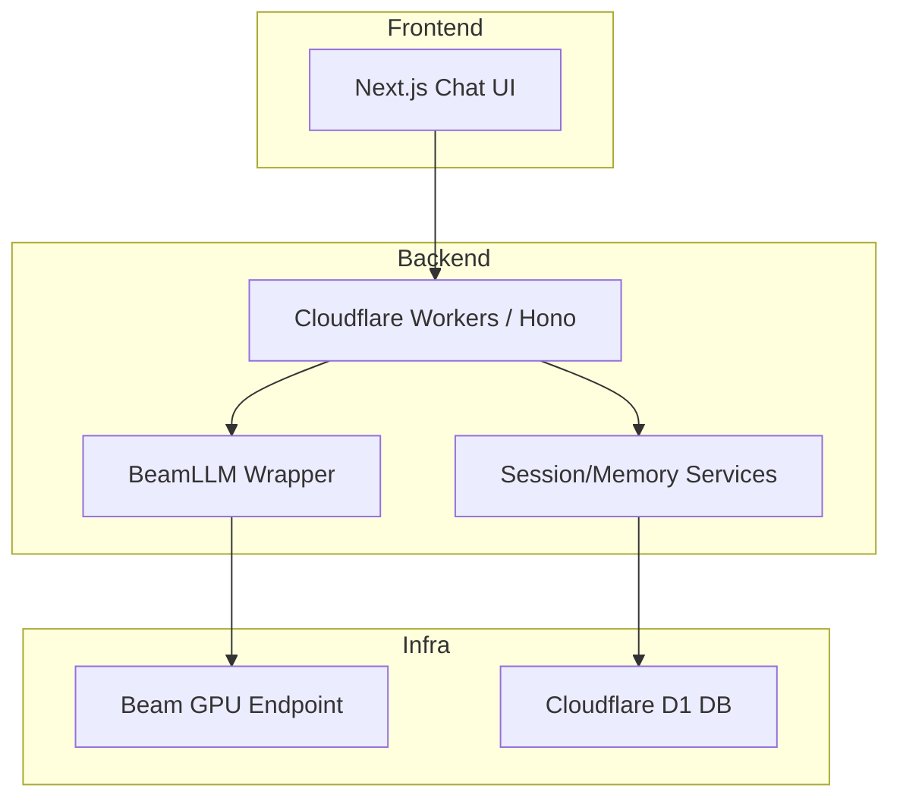

# TheChatBot

Private ChatGPT-like application with a Cloudflare Workers backend, Next.js frontend, Cloudflare D1 integration, and Beam-hosted LLM inference.

## Overview

TheChatBot is a full-stack chat application designed for private/self-controlled deployments.

- Frontend: Next.js 16 + React 19 + Tailwind
- Backend: Cloudflare Workers (Hono) + TypeScript
- LLM Inference: Beam endpoint (GPU) with model warm-start
- Data/Auth: Cloudflare D1 (sessions, messages, user context)

## Repository Structure

```text
TheChatBot/
  backend-cf/
    src/
      core/
      middleware/
      services/
      index.ts
    migrations/
    wrangler.toml
    package.json
  beam_deploy/
    app.py
  frontend/
    app/
    components/
    hooks/
    lib/
    types/
    package.json
```

## Architecture



## Features Implemented

- Chat page with session creation
- Streaming/non-stream backend routes
- Beam model invocation with retries for cold starts
- Beam deploy script with startup model fallback logic
- Sidebar/session UI scaffolding
- Cloudflare D1 database integration

## Prerequisites

- Node.js 20+
- npm 10+
- Beam CLI (`beam`)
- Cloudflare account with D1 enabled
- Hugging Face token with model access (if required)

## Environment Variables

### Backend (`backend-cf/wrangler.toml` & Secrets)

Wrangler Secrets:
- `BEAM_ENDPOINT_URL=https://your-beam-endpoint.app.beam.cloud`
- `BEAM_TOKEN=your_beam_token`
- `HF_TOKEN=your_hf_token`

Wrangler Vars (`wrangler.toml`):
- `APP_ACCESS_KEY=your_access_key`
- `CORS_ORIGINS=http://localhost:3000,http://127.0.0.1:3000`

### Frontend (`frontend/.env.local`)

```env
NEXT_PUBLIC_API_URL=http://localhost:8787
```

Notes:
- Do not commit `.env` files.
- `.gitignore` is configured to exclude secret env files.

## Local Development

### 1. Backend setup

```powershell
cd backend-cf
npm install
npm run db:init:local
```

Run backend:

```powershell
npm run dev
```

### 2. Frontend setup

```powershell
cd frontend
npm install
npm run dev
```

Frontend URL:
- `http://localhost:3000`

Backend URL:
- `http://localhost:8787`

## Beam Deployment

Deploy the endpoint from `beam_deploy`:

```powershell
cd beam_deploy
beam deploy app.py:generate
```

Important behavior in `beam_deploy/app.py`:
- Uses `HF_MODEL_ID` (if provided)
- Falls back to a valid default model candidate
- Keeps container warm (`keep_warm_seconds=300`) to reduce repeated cold starts

After deploy, add the Beam URL and Token as Cloudflare secrets:
```powershell
cd backend-cf
wrangler secret put BEAM_ENDPOINT_URL
wrangler secret put BEAM_TOKEN
```

## CI/CD (GitHub Actions)

Two workflows are included under `.github/workflows`:

- `ci.yml`: Runs on push/PR to `main`
  - Frontend: `npm ci`, `npm run build`
- `cd-beam.yml`: Deploys Beam endpoint from `beam_deploy/`
  - Triggers on `push` to `main` when `beam_deploy/**` changes
  - Can also be run manually via `workflow_dispatch`

### Required GitHub Secrets for CD

Set these repository secrets before running the Beam deploy workflow:

- `BEAM_TOKEN` (required)
- `HF_TOKEN` (optional but recommended for gated/private models)
- `HF_MODEL_ID` (optional override for model selection)

## API Endpoints (Backend)

- `GET /api/` - service metadata
- `GET /api/health` - health check
- `GET /api/info` - config status overview
- `POST /api/chat/stream` - chat response endpoint
- `POST /api/sessions` and `GET /api/sessions` - session handling
- `GET /api/memory/me` - user memory retrieval

## Common Troubleshooting

### 1) Frontend shows 404 for `/` or `/chat`
Cause:
- Stale/misbound Next dev process.

Fix:
- Stop existing frontend process and restart from `frontend/`.
- Ensure only one Next dev server is bound to port 3000.

### 2) Beam worker crash on startup
Cause:
- Invalid or inaccessible Hugging Face model ID.

Fix:
- Set valid `HF_MODEL_ID` in Beam environment.
- Ensure `HF_TOKEN` has access for gated/private models.
- Redeploy: `beam deploy app.py:generate`.

## Security Checklist

- Keep all tokens in secrets (Wrangler/Github) only, never in source code
- Rotate any token if accidentally exposed
- Restrict CORS origins in production
- Prefer separate dev/staging/prod Beam endpoints

## Roadmap

- Phase 1: Stable chat, sessions, memory, auth
- Phase 2: File upload + RAG
- Phase 3: Web search augmentation
- Phase 4: Voice I/O and personas

## Next Steps

1. Add `.env.example` templates for frontend with placeholder values only.
2. Add backend tests for `chat`, `sessions`, and `memory` routes.
3. Add production deployment profiles.
4. Implement Phase 2 (RAG): document ingestion pipeline + retrieval API.

## License

This repository includes a `LICENSE` file. Update the section here with the exact license name if needed.
