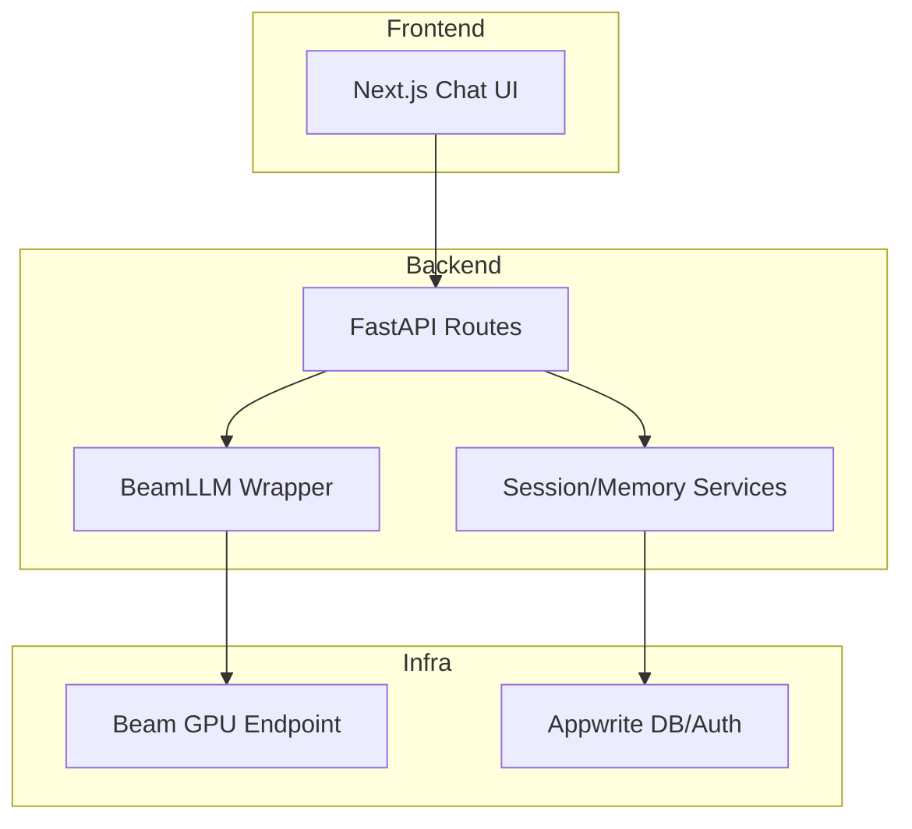

# TheChatBot

Private ChatGPT-like application with a Cloudflare for backend, Next.js frontend and Beam-hosted LLM inference.

## Overview

TheChatBot is a full-stack chat application designed for private/self-controlled deployments.

- Frontend: Next.js 16 + React 19 + Tailwind
- Backend: FastAPI + LangChain wrapper
- LLM Inference: Beam endpoint (GPU) with model warm-start
- Data/Auth: Appwrite (sessions, messages, user context)

## Repository Structure

```text
TheChatBot/
  backend/
    core/
    models/
    routes/
    services/
    main.py
    requirements.txt
  beam_deploy/
    app.py
  frontend/
    app/
    components/
    hooks/
    lib/
    types/
    package.json
  plan.md
```

## Architecture



## Features Implemented

- Chat page with session creation
- Streaming/non-stream backend routes
- Beam model invocation with retries for cold starts
- Beam deploy script with startup model fallback logic
- Sidebar/session UI scaffolding
- Appwrite service integration with graceful fallback behavior

## Prerequisites

- Python 3.12+
- Node.js 20+
- npm 10+
- Beam CLI (`beam`)
- Appwrite project (cloud or self-hosted)
- Hugging Face token with model access (if required)

## Environment Variables

### Backend (`backend/.env`)

```env
BEAM_ENDPOINT_URL=https://your-beam-endpoint.app.beam.cloud
BEAM_TOKEN=your_beam_token

APPWRITE_ENDPOINT=https://your-appwrite-endpoint/v1
APPWRITE_PROJECT_ID=your_project_id
APPWRITE_API_KEY=your_api_key
APPWRITE_DB_ID=chatbot_db

API_HOST=0.0.0.0
API_PORT=8000
CORS_ORIGINS=http://localhost:3000,http://127.0.0.1:3000
HF_TOKEN=your_hf_token
```

### Frontend (`frontend/.env.local`)

```env
NEXT_PUBLIC_API_URL=http://localhost:8000
NEXT_PUBLIC_APPWRITE_ENDPOINT=https://your-appwrite-endpoint/v1
NEXT_PUBLIC_APPWRITE_PROJECT_ID=your_project_id
```

Notes:
- Do not commit `.env` files.
- `.gitignore` is configured to exclude secret env files.

## Local Development

### 1. Backend setup

```powershell
cd backend
..\.venv\Scripts\python.exe -m pip install -r requirements.txt
```

Run backend:

```powershell
cd backend
..\.venv\Scripts\python.exe -m uvicorn main:app --reload --port 8000
```

### 2. Frontend setup

```powershell
cd frontend
npm install
npm run dev
```

Frontend URL:
- `http://localhost:3000`

Backend URL:
- `http://localhost:8000`

## Beam Deployment

Deploy the endpoint from `beam_deploy`:

```powershell
cd beam_deploy
beam deploy app.py:generate
```

Important behavior in `beam_deploy/app.py`:
- Uses `HF_MODEL_ID` (if provided)
- Falls back to a valid default model candidate
- Keeps container warm (`keep_warm_seconds=300`) to reduce repeated cold starts

After deploy, copy the Beam URL into `backend/.env` as `BEAM_ENDPOINT_URL`.

## CI/CD (GitHub Actions)

Two workflows are now included under `.github/workflows`:

- `ci.yml`: Runs on push/PR to `main`
  - Backend: install deps + run API smoke tests
  - Frontend: `npm ci`, `npm run build`
- `cd-beam.yml`: Deploys Beam endpoint from `beam_deploy/`
  - Triggers on `push` to `main` when `beam_deploy/**` changes
  - Can also be run manually via `workflow_dispatch`

### Required GitHub Secrets for CD

Set these repository secrets before running the Beam deploy workflow:

- `BEAM_TOKEN` (required)
- `HF_TOKEN` (optional but recommended for gated/private models)
- `HF_MODEL_ID` (optional override for model selection)

If `BEAM_TOKEN` is not set, the deploy job is skipped safely.

## API Endpoints (Backend)

- `GET /` - service metadata
- `GET /health` - health check
- `GET /info` - config status overview
- `POST /chat/stream` - chat response endpoint
- `POST /sessions` and `GET /sessions` - session handling

## Common Troubleshooting

### 1) Frontend shows 404 for `/` or `/chat`
Cause:
- Stale/misbound Next dev process.

Fix:
- Stop existing frontend process and restart from `frontend/`.
- Ensure only one Next dev server is bound to port 3000.

### 2) Beam worker crash on startup
Cause:
- Invalid or inaccessible Hugging Face model ID.

Fix:
- Set valid `HF_MODEL_ID` in Beam environment.
- Ensure `HF_TOKEN` has access for gated/private models.
- Redeploy: `beam deploy app.py:generate`.

### 3) Appwrite session/message warnings
Cause:
- `APPWRITE_DB_ID` does not exist or permissions mismatch.

Fix:
- Create/select the correct Appwrite database and collections.
- Verify API key scopes and project ID.

## Security Checklist

- Keep all tokens in env files only, never in source code
- Rotate any token if accidentally exposed
- Restrict CORS origins in production
- Use least-privilege Appwrite API key scopes
- Prefer separate dev/staging/prod Beam endpoints
- Add secret scanning in CI before deploy

## Roadmap

- Phase 1: Stable chat, sessions, memory, auth
- Phase 2: File upload + RAG
- Phase 3: Web search augmentation
- Phase 4: Voice I/O and personas

## Next Steps

1. Add `.env.example` templates for backend and frontend with placeholder values only.
2. Configure Appwrite collections and indexes for sessions/messages and verify write permissions.
3. Add backend tests for `chat`, `sessions`, and `memory` routes.
4. Add CI checks:
   - lint + type checks
   - secret scan
   - basic API smoke test
5. Add production deployment profiles:
   - separate Beam endpoint per environment
   - stricter CORS and error handling
6. Implement Phase 2 (RAG): document ingestion pipeline + retrieval API.

## License

This repository includes a `LICENSE` file. Update the section here with the exact license name if needed.
